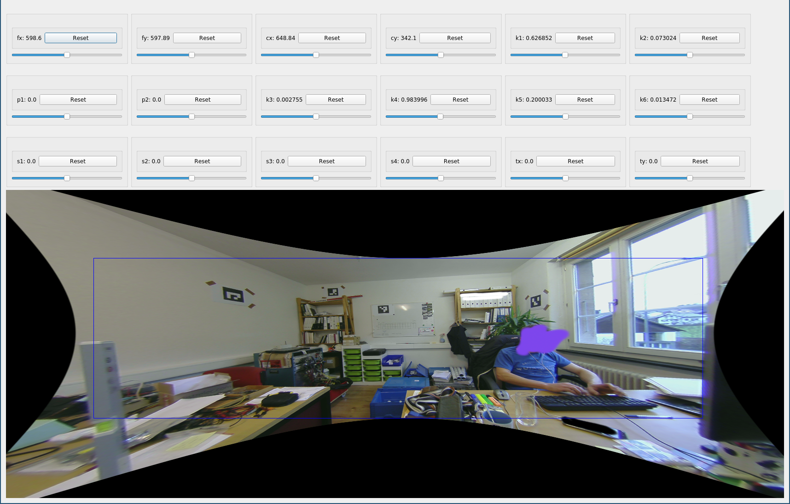

# OpenCV live undistortion

 This repo contains an PyQT app that allows modifying the different distortion coefficient used by OpenCV and get a live undistortion of a target image. It can be useful to fine tune some parameters but is not meant for a full calibration as the parameter space is way too big. I can recommend [RTBMap](http://introlab.github.io/rtabmap/) and the calibration tool present in the Settings for an initial guess.



 ## Usage

 You will first need to place a picture to undistort in the same folder under the name `image.png`. 
 It is possible to specify intial distortion parameters directly in the [python file](interactive_distortion.py#L120).

 ```bash
 pip install -r requirements.txt
 python interactive_distortion.py 
 ```

## Licence 

This work is licensed un the GPL licence. See the [licence file](LICENCE) for more information.
